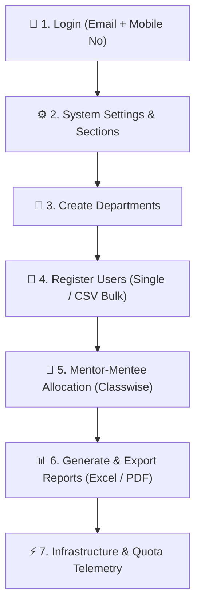

# Lumina — Administrator Guide

Welcome to the **Lumina Administrator Guide**. This document provides step-by-step instructions for System Administrators to configure, manage, allocate, and monitor the Lumina Student Mentorship Platform.

---

## 🔑 Login & Access Credentials

| Field | Login Format | Example |
| :--- | :--- | :--- |
| **Username** | Your Registered Admin Email | `admin@lumina.edu` |
| **Password** | Your Registered Mobile Number | `9876543210` |

> [!IMPORTANT]
> Always log in using your **registered email address as the username** and your **mobile number as the password**. Upon first login, ensure your browser session is secure.

---

## 🛠️ Complete Admin Workflow

---

### Step 1: System Infrastructure Telemetry (`/#/admin/infrastructure`)
- Navigate to **Intelligence & Infrastructure Center** in the sidebar.
- Monitor real-time database reads/writes, Firebase Spark quota usage ($0.00/mo free tier active), WebRTC connectivity nodes, and system health status.

### Step 2: System Settings & Sections Setup (`/#/admin/settings`)
- Configure operational **Sections** (e.g., *Exam Section*, *Student Section*, *Academic Section*, *Travel Section*).
- These sections serve as the middle tier in the issue escalation matrix for routing student issues.

### Step 3: Department Management (`/#/admin/departments`)
- Add new academic departments (e.g., *Computer Engineering*, *Information Technology*, *Mechanical Engineering*).
- Assign department codes, view mentor-to-student ratios, and edit existing departments.

### Step 4: User Onboarding & Registration (`/#/admin/users`)
- **Single User Registration**: Add individual Students, Faculty Mentors, HODs, or Deans.
- **CSV Bulk Import**:
  1. Click **Download Registration CSV Template**.
  2. Populate CSV with columns: `role`, `name`, `email`, `password` *(Mobile No)*, `department`, `class`, `enrollmentNumber`.
  3. Upload the populated file. System registers users in Firebase Auth & Firestore automatically.

### Step 5: Classwise Mentor Allocation (`/#/admin/allocation`)
- **Classwise Manual Allocation**:
  1. **Step 1**: Select Mentor Name.
  2. **Step 2**: Select Class (e.g., `TY CORE 1`, `TY CORE 2`).
  3. **Step 3**: Tick up to 50 students in that class batch.
  4. **Step 4**: Click **Allocate Ticked Students**.
- **Global Auto-Allocate**:
  - Automatically balances student loads across department faculty mentors up to maximum capacity (`20` mentees per mentor).
- **Academic Year Reset**:
  - Use **Reset / Unallot All** button to clear current allocations for annual academic year transitions.

### Step 6: Report Generation & Exports (`/#/admin/allocation`)
- **Master Allocation Export**: Export full institution allocation list classwise (e.g., `TY CORE 1` first, `TY CORE 2` next) to Excel or PDF.
- **One-Click Single Mentor Export**: Select any faculty mentor to download their individual mentee roster.

---

## 🔒 Security Best Practices
- Never share administrative credentials.
- Periodically review user roles under `/#/admin/users` to ensure former faculty or students do not retain administrative access.
