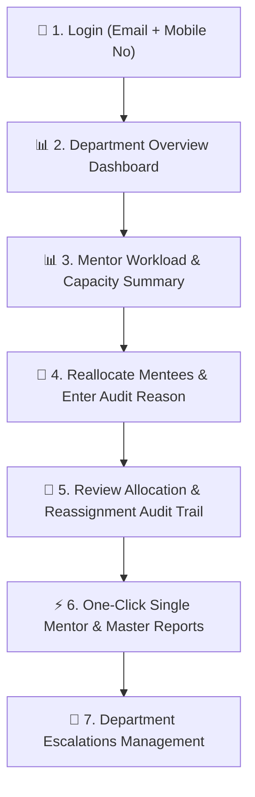

# Lumina — Head of Department (HOD) Guide

Welcome to the **Lumina HOD Guide**. This manual details how Heads of Department manage faculty mentorship workloads, reassign mentees, audit allocation history, resolve department escalations, and generate single-mentor & master reports.

---

## 🔑 Login & Access Credentials

| Field | Login Format | Example |
| :--- | :--- | :--- |
| **Username** | Your Department HOD Email | `hod.cs@lumina.edu` |
| **Password** | Your Registered Mobile Number | `9876543210` |

> [!IMPORTANT]
> Log in using your **HOD department email address as username** and your **mobile number as password**.

---

## 🛠️ Complete HOD Operational Workflow

---

### Step 1: Department Overview Dashboard (`/#/hod/dashboard`)
- Review high-level department metrics:
  - Total Faculty Mentors & Assigned Students
  - Open & Resolved Issues
  - Escalations pending HOD review

### Step 2: Mentor Workload & Capacity Center (`/#/hod/reports`)
- Access the **Mentor Workload & Capacity Summary** table:
  - **Mentor Name** & Designation
  - **Total Assigned Students**
  - **Capacity (Max)** (Default: `20`)
  - **Remaining Capacity** (`Capacity - Assigned`)
  - **Capacity Progress Bar**: Visual load indicator (Green $<80\%$, Yellow $80-99\%$, Red $100\%$).

### Step 3: Reassign Mentees with Audit Reason (`/#/hod/management`)
1. Navigate to **Student Management** (`/#/hod/management`).
2. Locate the student requiring mentor reallocation.
3. Select the new mentor from the dropdown.
4. **Mandatory Audit Step**: System will prompt: *"Enter reason for mentor reassignment"*.
5. Enter a descriptive reason (e.g. *Workload Balancing*, *Academic Specialization Change*).
6. Click **OK**. Reassignment is saved instantly with an immutable audit entry.

### Step 4: Audit Trail Inspection (`/#/hod/reports`)
- Scroll to **Allocation & Reassignment Audit Trail**:
  - Review historical records: Student Name, Class, Previous Mentor $\rightarrow$ New Mentor, Reassigned By (HOD), Timestamp, and Reason.

### Step 5: Department Directory & Multi-Filter (`/#/hod/reports`)
- Use live filters to quickly inspect mentees:
  - Filter by **Mentor**
  - Filter by **Class**
  - Filter by **Department**
  - Filter by **Risk Level**
  - **Live Search by PRN / Enrollment Number / Student Name**

### Step 6: One-Click Single Mentor & Master Report Downloads (`/#/hod/reports`)
- **Single Mentor Report**: Select a mentor from the **One-Click Mentor Report Download** bar and click **Excel List** or **PDF List**.
- **Master Department Report**: Download complete classwise department report using **Export Master Excel** or **Export Master PDF**.

### Step 7: Department Escalations (`/#/hod/escalations`)
- Review issues escalated by Section Heads.
- Take resolution action or escalate unresolved critical matters to the Dean with attachments and notes.
