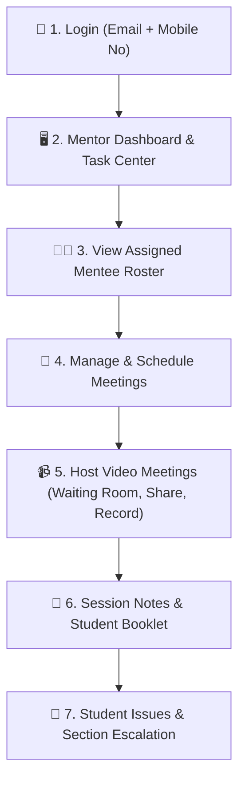

# Lumina — Faculty Mentor Guide

Welcome to the **Lumina Faculty Mentor Guide**. This manual guides faculty mentors through student mentorship management, conducting WebRTC video meetings, recording session notes, and resolving student issues.

---

## 🔑 Login & Access Credentials

| Field | Login Format | Example |
| :--- | :--- | :--- |
| **Username** | Your Faculty Email | `prof.smith@lumina.edu` |
| **Password** | Your Registered Mobile Number | `9876543210` |

> [!IMPORTANT]
> Log in using your **Faculty Email address as username** and your **Mobile Number as password**.

---

## 🛠️ Complete Mentor Operational Workflow

---

### Step 1: Mentor Dashboard (`/#/mentor/dashboard`)
- Overview of your assigned mentee count, upcoming scheduled meetings, pending meeting requests, and open student issues.

### Step 2: Assigned Mentee Roster (`/#/mentor/students`)
- View full list of assigned students sorted by class.
- Inspect student profiles: Enrollment Number, Class, Contact Details, and Academic Performance.

### Step 3: Meeting Management (`/#/mentor/meetings`)
- Review meeting requests submitted by students.
- **Approve**: Accept requested date/time slot.
- **Reschedule**: Suggest an alternate date/time slot.
- **Create Meeting**: Host a instant meeting or schedule a one-on-one session directly.

### Step 4: WebRTC Video Call Hosting (`/#/meeting-room`)
- Click **Join Call** to enter the video conference room.
- **Host Controls**:
  - **Waiting Room**: View waiting mentees and click **Admit** or **Deny**.
  - **Audio / Video**: Toggle microphone and camera.
  - **Screen Share**: Share entire screen, application window, or browser tab (with audio mixing).
  - **In-Call Chat**: Real-time messaging with mentee.
  - **Recording**: Record session video/audio for academic records.

### Step 5: Academic Booklet & Session Notes (`/#/mentor/notes` & `/#/mentor/booklet`)
- Document meeting outcomes, advice provided, and student goals.
- Assign actionable tasks to students with completion deadlines.

### Step 6: Student Issue Resolution & Escalation (`/#/mentor/issues`)
- View issues raised by your assigned mentees (Academic, Administrative, Financial, Personal).
- **Direct Resolution**: Mark issue resolved with guidance notes.
- **Section Escalation**: If an issue requires administrative intervention, escalate it to the appropriate **Section Head** (e.g., *Exam Section*, *Student Section*).
