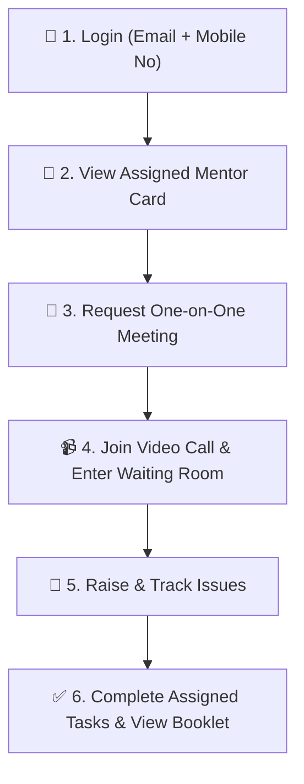

# Lumina — Student Mentee Guide

Welcome to the **Lumina Student Mentee Guide**. This guide provides step-by-step instructions for students to connect with their assigned faculty mentor, request one-on-one meetings, join video calls, raise academic or administrative issues, and complete tasks.

---

## 🔑 Login & Access Credentials

| Field | Login Format | Example |
| :--- | :--- | :--- |
| **Username** | Your Registered Student Email | `john.doe@student.lumina.edu` |
| **Password** | Your Registered Mobile Number | `9876543210` |

> [!IMPORTANT]
> Log in using your **registered email address as username** and your **mobile number as password**.

---

## 🛠️ Complete Student Operational Workflow

---

### Step 1: Student Dashboard (`/#/student/dashboard`)
- View your assigned **Faculty Mentor Contact Card**: Mentor Name, Department, Designation, and Email.
- Quick summary of your upcoming meetings, active tasks, and raised issue status.

### Step 2: Requesting a One-on-One Meeting (`/#/student/meetings`)
1. Go to **Meetings** (`/#/student/meetings`).
2. Click **Request Meeting**.
3. Select preferred **Date**, **Time Slot**, and **Topic** (e.g. *Academic Performance*, *Career Guidance*, *Project Advice*).
4. Click **Submit Request**. You will be notified when your mentor approves or reschedules.

### Step 3: Joining Video Calls (`/#/meeting-room`)
1. When your meeting time arrives, click **Join Meeting**.
2. You will enter the **Secure Waiting Room** until your mentor admits you.
3. Use interactive features:
   - **Camera & Mic**: Turn video/audio on or off.
   - **Screen Share**: Share presentation or project code.
   - **In-Call Chat**: Chat directly with your mentor.

### Step 4: Raising & Tracking Issues (`/#/student/issues`)
1. Navigate to **Issues** (`/#/student/issues`).
2. Click **Raise New Issue**.
3. Fill in:
   - **Category**: Academic, Exam, Fees/Financial, Hostel, Facilities.
   - **Subject & Description**: Explain your issue clearly.
   - **Priority**: Low, Medium, High.
4. Track live progress as your issue is handled by your **Mentor** $\rightarrow$ **Section Head** $\rightarrow$ **HOD** $\rightarrow$ **Dean**.

### Step 5: Tasks & Mentorship Booklet (`/#/student/tasks` & `/#/student/booklet`)
- View tasks assigned by your mentor with deadline dates.
- Mark tasks as **Completed** upon finishing.
- Review your mentorship booklet history and past session notes.
